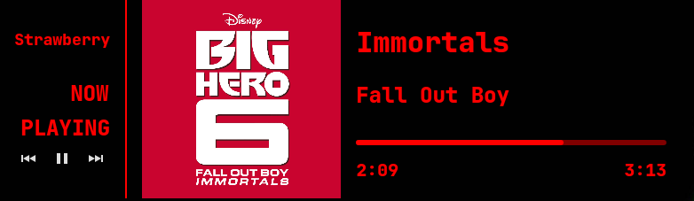

# Now-Playing-RED

*A BLOOD RED - NowPlaying Widget With Media Controls and Slider!*
---

#### *Disclaimer: Needs KDE-PLASMA to work.*

## INSTALL

Use the [Makefile](./Makefile).

+ `$ make install`

## UNINSTALL

Use the [Makefile](./Makefile).

+ `$ make remove`

## LICENSE
+ Read Licensing information at [LICENSE](./LICENSE)

#### TL;DR
+ GNU GPL V2
+ Free for personal use.
+ Free to modify & distribute/publish source code.
+ Same license and copyright notice must be published.
+ State changes & Disclose source.
+ Disclaimer of warranty (absence of any warranty) must be stated.

## Acknowledgements

+ Much of the code is forked from [nihilist-dev's](https://github.com/nihilist-dev/) work [NowPlaying](https://github.com/nihilist-dev/NowPlaying), which was licensed under [CC0](https://github.com/nihilist-dev/NowPlaying/blob/1bf0b35ba1c99e9286c1d6d590c53891a8ca0021/LICENSE) (The Creative Commons CC0 Public Domain Dedication).

+ The Slider component is derived from [Chris Cortopassi's](https://www.ics.com/author/chris-cortopassi) blog [Creating QML Controls From Scratch: Slider](https://www.ics.com/blog/creating-qml-controls-scratch-slider)

## IMPROVEMENTS TO BE EXPECTED
- [ ] Option to change color of the widget text.
- [ ] Option to change the dimensions of Album art.
- [ ] Smooth sliding with Slider (Drag operation).
- [ ] Miscellaneous: Fix backend warnings (Layout overflows, containment etc.)

## Preview
### Normal

### On Hover

